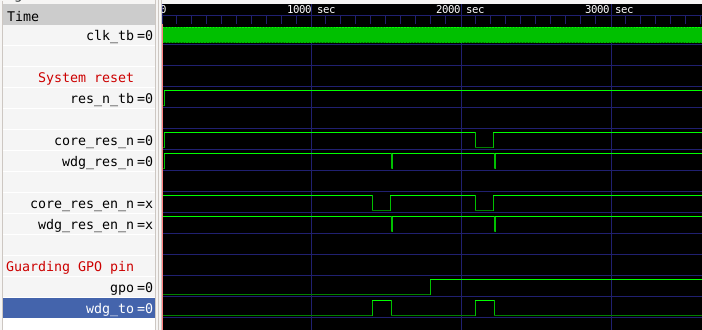

<p align="center">
  
</p>

# Verilog RISC-V Watchdop IP
Modules are developed following RISC-V spec:
https://github.com/riscvarchive/riscv-watchdog/blob/main/riscv-watchdog.adoc

# Integration to RISC-V cores
## Reset-based
The proposed integration scheme connects the second timeout value of the watchdog to reset logic of the SoC.
The SoC shown here is the FazyRV bit-serial RISC-V core by Meinhard Kissich

<p align="center">
  
</p>

## Interrupt Based
Alternativly the Wdg can be connected to the IRQ inputs of the given RV core.

<p align="center">
  
</p>

# Notes for HW
It is recommended to have a separate gp(i)o output from the CORE to ignore watchdog interrupts in the case of malfuctioning of this IP.

*Resets for Core and Watchdog are low-active!*
```c
// wdg_res_en_n is gated by ~gpo[1] (inverted as init by 0)
assign core_res_n = rst_in & (core_res_en_n | ~gpo[2]);
```
See here:
GPO is initialized to 0 - thus in this case no Watchdog reset requests are given to the core. 

If Core SW changes the GPO value to 1 the resets caused by Watchdog timeout are forwarded to the core.

<p align="center">
  
</p>
The waveform shows

> GPO = 0 (init value): Watchdog interrupts do not take effect on the core.

> GPO = 1: Watchdog interrupts reset the core via the reset logic.

# Watchdog register map

| Field | Bits  | Description  |
|---|---|---|
| WDEN  | 0:0  | Enable the watchdog timer  |
| RESERVED  | 1:1  | Reserved for future use  |
| S1WTO  | 2:2  | Stage 1 watchdog timeout  |
| S2WTO  | 3:3  | Stage 2 watchdog timeout  |
| WTOCNT  | 13:4  | Watchdog timeout count  |
| RESERVED  | 31:9  | Reserved for future use  |

see: https://github.com/riscvarchive/riscv-watchdog/blob/main/riscv-watchdog.adoc

| Field | Bits | Description |
|---|---|---|
| CNT | 9:0  | Current count value of timeout counter  |
| RESERVED  | 31:10  | Reserved for future use  |
The timeout counter counts upwards up till

# Notes for SW
*Program WTOCNT value via SW only when the watchdog is not enabled*

Otherwise unintended behavior can occure i.e when the free running watchdog timer just then suddenly hits the newly programmed value. Then system would go into reset!

# Watchdog Timeout Time Calculation
Timeout period of the watchdog depends on the following parameters:
- **N**: WTOCNT value (10 bit field)
- **M**: System clock resolution (period)
- **B**: Bit position of clock divider

A clock divider reduces the system clock to a watchdog tick source.
The bit position value of the clock divider is set during synthesis time. Thus in an ASIC it is fixed.
Default implementation: *Bit 19*

**t_timeout_period** = **N** * **M** * 2^(**B**+1)

Example:
Given a clock speed of **M=20MHz** -> period = 50ns
And **N** being set to the highest value = 0x3FF (dec: 1023)

**t_timeout_period** = 1023 * 50ns * 2^(19+1) = 53s