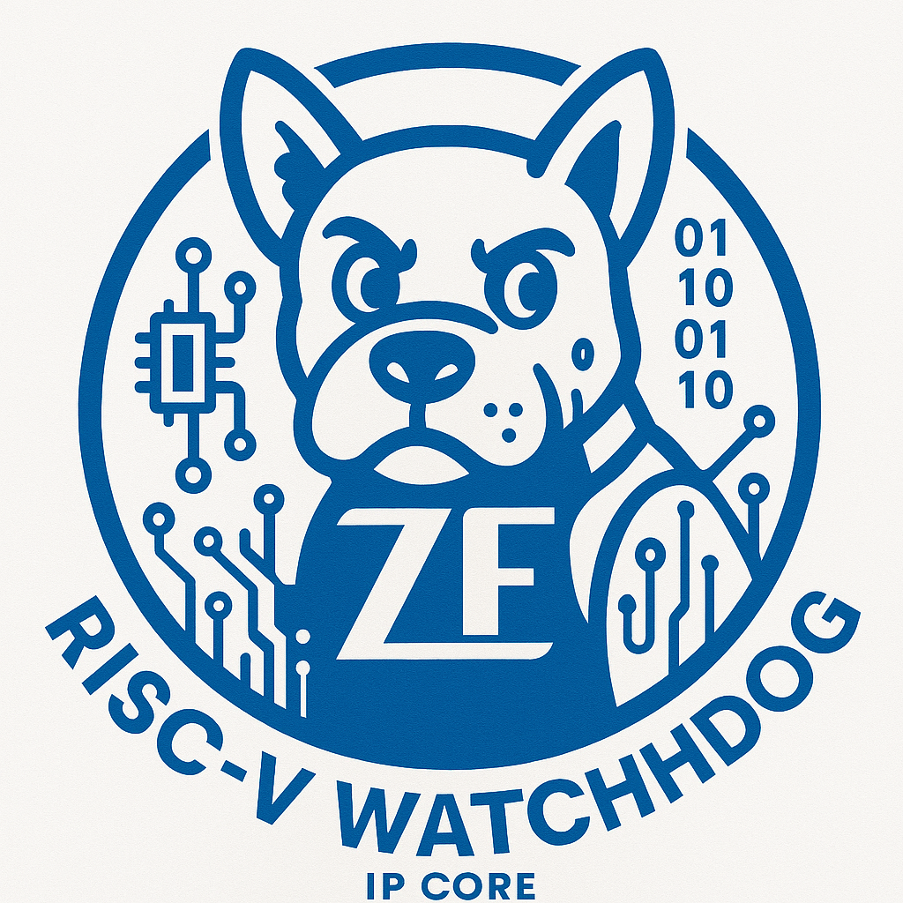

  

# Verilog RISC-V Watchdop IP
Modules are developed following RISC-V spec:
https://github.com/riscvarchive/riscv-watchdog/blob/main/riscv-watchdog.adoc

# Tooling
This project is Verilog only as to keep compatibility with open-source tools high.

Sim:
Icarus Verolog,
Verilator (also to get a SystemC model)

Synthesis:
Yosys
(Vivado)

## Rggen tool
To generate the register file for this project with a Wishbone interface
(can be easily ported to AXI)
the Rggen tool is used.
Refer to the Wiki for more information:
https://github.com/rggen/rggen/wiki

The s1wto and s2wto are set by HW and cleared by SW.
The HW (set) should take priority over clearing.

# Simulation
Implement a wb master to talk to the watchdog:
https://zipcpu.com/blog/2017/06/08/simple-wb-master.html
The watchdog will reset the wb master if it misses to write to the register

# Wishbone
Memory map:
- Offset 0: 